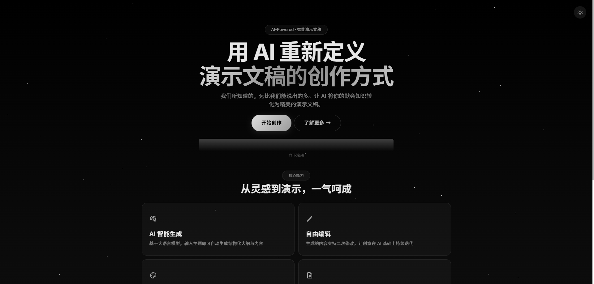
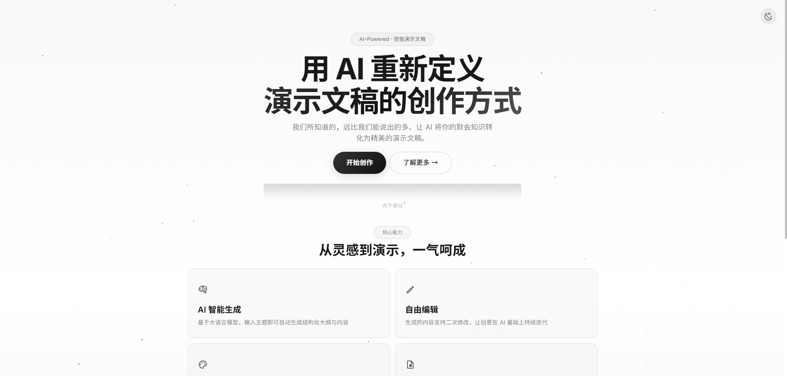

# Ai-Creat-PPTX

<div align="center">


**基于 AI 技术的智能 PPT 生成器**

[功能特点](#核心功能) · [快速开始](#快速开始) · [使用流程](#使用流程) · [技术架构](#技术架构) · [灵感来源](#灵感来源)

</div>

---

## 项目简介

Ai-Creat-PPTX 是一款基于 AI 大语言模型的智能 PPT 生成 Web 应用。用户只需输入主题，系统即可自动生成结构化大纲、选择精美模板、一键生成专业 PPTX 文件。

本项目采用 **本地 API 配置** 方案，无需部署后端服务，用户在浏览器端配置自己的 AI API Key 即可使用，保护隐私且灵活便捷。

---

## 项目预览

### 🌙 暗色模式



### ☀️ 亮色模式



---

## 核心功能

### 🤖 AI 智能生成
- **大纲自动生成** — 支持 DeepSeek、OpenAI 等大语言模型，输入主题即可生成结构化 PPT 大纲
- **流式输出** — 采用 SSE (Server-Sent Events) 技术，实时展示生成过程
- **内容续写** — 基于大纲自动填充每页幻灯片的详细内容

### ✏️ 可视化编辑
- **大纲编辑器** — 支持章节增删改，实时预览 Markdown 渲染效果
- **富文本支持** — 支持标题、正文、列表等多种内容格式

### 🎨 多模板系统
- **8 种内置模板** — 蓝色商务 / 绿色清新 / 红色活力 / 深色科技 / 简约白 / 优雅灰 / 科技蓝 / 自然绿
- **渐变背景** — 每套模板配备精心设计的渐变色背景
- **装饰元素** — 自动添加几何图形装饰，提升视觉效果

### 🌓 用户体验
- **日间 / 夜间模式** — 一键切换全局主题，护眼舒适
- **磁性粒子动画** — 生成中状态展示交互式粒子效果（鼠标吸引互动）
- **响应式设计** — 适配桌面端和移动端设备

### 🔒 隐私安全
- **本地 API 配置** — API Key 存储在浏览器 localStorage，不上传服务器
- **无后端依赖** — 纯前端应用，数据完全本地处理

---

## 快速开始

### 环境要求

- Node.js >= 18.0.0
- npm >= 9.0.0 或 yarn >= 1.22.0

### 安装依赖

```bash
# 使用 npm
npm install

# 或使用 yarn
yarn install
```

### 启动开发服务器

```bash
# 使用 npm
npx next dev -p 3199

# 或使用 yarn
yarn dev -p 3199
```

访问 http://localhost:3199 即可使用。

### 生产构建

```bash
# 构建生产版本
npm run build

# 启动生产服务器
npm start
```

---

## 使用流程

### 步骤概览

```
┌─────────────┐    ┌─────────────┐    ┌─────────────┐    ┌─────────────┐    ┌─────────────┐
│   01 开始    │──▶│   02 输入    │──▶│   03 编辑    │──▶│   04 选择    │──▶│   05 生成    │
│    创作     │    │    主题     │    │    大纲     │    │    模板     │    │   PPTX     │
└─────────────┘    └─────────────┘    └─────────────┘    └─────────────┘    └─────────────┘
```

### 详细步骤

#### 1️⃣ 配置 AI API
- 进入"参数设置"页面
- 填写以下配置项：
  - **API URL**: AI 服务地址（如 `https://api.deepseek.com`）
  - **Model**: 模型名称（如 `deepseek-chat`）
  - **Token**: API 密钥（如 `sk-xxxxx`）
- 点击"本地临时保存"

#### 2️⃣ 生成大纲
- 在首页输入 PPT 主题
- 选择生成选项：
  - 语言：中文 / 英文等
  - 大纲长度：简短 / 常规 / 详细
  - 额外要求：补充说明
- 点击"立即生成"，等待 AI 流式输出

#### 3️⃣ 编辑大纲
- 查看生成的 Markdown 格式大纲
- 支持直接编辑文本内容
- 调整章节结构和顺序

#### 4️⃣ 选择模板
- 浏览 8 种内置模板预览图
- 根据演示场景选择合适风格
- 模板包含配色方案、字体样式、装饰元素

#### 5️⃣ 生成 PPTX
- 点击"下一步：生成PPTX"
- 观察磁性粒子动画（生成中状态）
- 生成完成后在线预览各页幻灯片
- 支持导出下载 PPTX 文件

---

## 本地 API 配置说明

| 参数 | 说明 | 示例值 |
|------|------|--------|
| API URL | AI 服务基础地址 | `https://api.deepseek.com` |
| Model | 模型名称 | `deepseek-chat` / `deepseek-v4-pro` / `gpt-4` |
| Token | API 密钥 | `sk-xxxxxxxxxxxxxxxx` |

> **注意**: 配置保存在浏览器 localStorage 中，刷新页面后仍然有效。

---

## 项目架构

```
Ai-Creat-PPTX/
├── public/                          # 静态资源
│   ├── images/                      # 图标资源
│   └── locales/                     # 国际化语言包 (zh/en/fr/ar)
├── src/
│   ├── pages/                       # Next.js 页面路由
│   │   ├── index.tsx                # 首页 Landing Page
│   │   ├── _app.tsx                 # 应用入口
│   │   ├── _document.tsx            # HTML 文档模板
│   │   └── api/                     # API 路由
│   │       ├── generateOutline.ts   # 🎯 本地大纲生成代理 (SSE 流式)
│   │       ├── generateContent.ts   # 🎯 本地 PPT 内容生成代理
│   │       ├── randomTemplates.ts   # 内置模板列表 API
│   │       └── templatePreview.ts   # SVG 模板预览图 API
│   ├── views/AiPPTX/               # 核心 PPT 生成模块
│   │   ├── AiPPTX.tsx              # 主组件 (Stepper 步骤条)
│   │   ├── StepOneInputData.tsx    # 步骤1: 输入数据
│   │   ├── StepTwoThreeGenerateOutline.tsx  # 步骤2-3: 生成/编辑大纲
│   │   ├── StepFourSelectTemplate.tsx      # 步骤4: 选择模板
│   │   ├── StepFiveGeneratePpt.tsx         # 步骤5: 生成 PPT
│   │   ├── Setting.tsx             # 参数设置页
│   │   ├── LocalConfig.ts          # 本地配置管理 (localStorage)
│   │   ├── OutlineEdit.tsx         # 大纲编辑器
│   │   ├── SelectTemplate.tsx      # 模板选择器
│   │   ├── MagneticParticles.tsx   # 🎨 磁性粒子动画组件
│   │   ├── Config.ts               # 后端 API 地址配置
│   │   └── Components/
│   │       └── StepperCustomDot.tsx # 自定义步骤点组件
│   ├── functions/AiPPTX/           # PPT 生成引擎
│   │   ├── ppt2svg.js              # PPT → SVG 渲染器
│   │   ├── ppt2canvas.js           # PPT → Canvas 渲染器
│   │   ├── element.js              # 元素工厂函数
│   │   ├── cover.js                # 封面页生成
│   │   ├── animation.js            # 动画效果
│   │   ├── chart.js                # 图表生成
│   │   ├── geometry.js             # 几何图形工具
│   │   └── sse.ts                  # SSE 客户端封装
│   ├── configs/                    # 全局配置
│   │   ├── auth.ts                 # 应用名称、主题配置
│   │   ├── i18n.ts                 # 国际化配置
│   │   └── themeConfig.ts          # 主题配置
│   ├── @core/                      # 核心框架代码
│   │   ├── components/             # 通用 UI 组件
│   │   ├── layouts/                # 布局组件
│   │   ├── theme/                  # MUI 主题定制
│   │   └── styles/                 # 全局样式
│   └── store/                      # Redux 状态管理
├── resources/                      # 项目资源
│   ├── doc/                        # 文档资料
│   ├── guide/                      # 使用指南截图
│   └── images/                     # 图片资源
├── styles/
│   └── globals.css                 # 全局 CSS 样式
├── .env                            # 环境变量
├── next.config.js                  # Next.js 配置
├── package.json                    # 项目依赖
└── tsconfig.json                   # TypeScript 配置
```

---

## 技术栈

| 类别 | 技术 | 说明 |
|------|------|------|
| **框架** | Next.js 15 | React 全栈框架，App Router |
| **UI 库** | Material-UI (MUI) | Google Material Design 组件库 |
| **状态管理** | Redux Toolkit | 可预测的状态容器 |
| **AI 接口** | OpenAI Compatible API | 兼容 DeepSeek、OpenAI 等 |
| **流式传输** | SSE (Server-Sent Events) | 实时数据推送 |
| **PPT 渲染** | ppt2svg / ppt2canvas | SVG 和 Canvas 双渲染引擎 |
| **动画** | Canvas API | 磁性粒子交互系统 |
| **国际化** | i18next | 多语言支持 (中/英/法/阿) |
| **样式** | Emotion | CSS-in-JS 解决方案 |
| **类型检查** | TypeScript | 静态类型检查 |

---

## 自定义修改指南

| 修改目标 | 文件路径 | 说明 |
|---------|---------|------|
| 产品名称 | `src/configs/auth.ts` | 修改 `AppName` 变量 |
| 主题配色 | `src/@core/theme/palette/index.ts` | 修改调色板颜色 |
| 模板配色 | `src/pages/api/generateContent.ts` | 修改模板渐变色方案 |
| 全局样式 | `styles/globals.css` | 修改 UI 细节样式 |
| 后端 API | `src/views/AiPPTX/Config.ts` | 切换后端服务地址 |

---

## 端口与访问

| 环境 | 地址 |
|------|------|
| 本地开发 | http://localhost:3199 |
| 局域网访问 | http://192.168.99.119:3199 |
| 生产部署 | 根据服务器配置 |

---

## 灵感来源

### 🙏 致谢

本项目的开发灵感来源于以下开源项目：

#### 主要灵感来源

**[SmartSchoolAI/ai-to-pptx](https://github.com/SmartSchoolAI/ai-to-pptx)**

> Ai-to-pptx 是使用 AI 技术来自动生成 PPTX 的开源项目，支持在线修改和导出 PPTX。

**原项目核心功能：**
- 使用 DeepSeek 等大语言模型生成大纲
- 生成的内容允许用户再次修改
- 生成 PPTX 时可选择不同模板
- 支持在线修改 PPTX 的文字内容、样式、图片
- 支持导出 PPTX、PDF、PNG 等多种格式
- 支持用户设置单独的 LOGO 和相关背景图片
- 支持用户设计自己的模板上传到共享平台

**本项目在原项目基础上的改进与创新：**

| 特性 | 原项目 | 本项目 (Ai-Creat-PPTX) |
|------|--------|----------------------|
| **后端依赖** | 需要 PHP 后端服务 | ✅ 纯前端，无需后端 |
| **API 配置** | 服务端配置 | ✅ 浏览器端本地配置 |
| **隐私安全** | 数据经过服务器 | ✅ 数据完全本地处理 |
| **部署难度** | 需要部署前后端 | ✅ 只需部署前端 |
| **用户门槛** | 需要技术能力 | ✅ 开箱即用 |
| **视觉体验** | 标准 MUI 界面 | ✅ 磁性粒子动画 + 渐变背景 |
| **设计理念** | 功能导向 | ✅ 融入默会知识理论 |

#### 其他参考项目

**[veasion/aippt-react](https://github.com/veasion/aippt-react)**

> 原项目前端代码引用于此，感谢 Veasion 开放的源代码。

---

## 开源协议

本项目采用 **MIT License** 开源协议。

```
MIT License

Copyright (c) 2026 Ai-Creat-PPTX Contributors

Permission is hereby granted, free of charge, to any person obtaining a copy
of this software and associated documentation files (the "Software"), to deal
in the Software without restriction, including without limitation the rights
to use, copy, modify, merge, publish, distribute, sublicense, and/or sell
copies of the Software, and to permit persons to whom the Software is
furnished to do so, subject to the following conditions:

The above copyright notice and this permission notice shall be included in all
copies or substantial portions of the Software.

THE SOFTWARE IS PROVIDED "AS IS", WITHOUT WARRANTY OF ANY KIND, EXPRESS OR
IMPLIED, INCLUDING BUT NOT LIMITED TO THE WARRANTIES OF MERCHANTABILITY,
FITNESS FOR A PARTICULAR PURPOSE AND NONINFRINGEMENT. IN NO EVENT SHALL THE
AUTHORS OR COPYRIGHT HOLDERS BE LIABLE FOR ANY CLAIM, DAMAGES OR OTHER
LIABILITY, WHETHER IN AN ACTION OF CONTRACT, TORT OR OTHERWISE, ARISING FROM,
OUT OF OR IN CONNECTION WITH THE SOFTWARE OR THE USE OR OTHER DEALINGS IN THE
SOFTWARE.
```

---

## 贡献指南

欢迎贡献代码！请遵循以下步骤：

1. Fork 本仓库
2. 创建特性分支 (`git checkout -b feature/AmazingFeature`)
3. 提交更改 (`git commit -m 'Add some AmazingFeature'`)
4. 推送到分支 (`git push origin feature/AmazingFeature`)
5. 开启 Pull Request

---

## 常见问题

### Q: 如何获取 AI API Key？

**DeepSeek**: 访问 https://platform.deepseek.com 注册并获取 API Key

**OpenAI**: 访问 https://platform.openai.com 注册并获取 API Key

### Q: 支持哪些 AI 模型？

任何兼容 OpenAI Chat Completions API 格式的模型都支持，包括：
- DeepSeek (deepseek-chat, deepseek-v4-pro)
- OpenAI (gpt-4, gpt-3.5-turbo)
- 其他兼容模型

### Q: 生成的 PPT 可以商用吗？

可以，但请注意：
- AI 生成的内容可能涉及版权问题，请自行确认
- 模板使用请遵循相应授权协议

### Q: 如何更换或新增模板？

模板配置位于 `src/pages/api/randomTemplates.ts`，可按照现有格式添加新模板。

---

## 更新日志

### v0.0.1 (2026-06-05)

- 🎉 初始版本发布
- ✅ AI 大纲生成功能
- ✅ 8 种内置模板
- ✅ 本地 API 配置
- ✅ 日间/夜间模式切换
- ✅ 磁性粒子动画效果
- ✅ SSE 流式输出
- ✅ PPT 在线预览与导出

---

## 联系方式

- **项目地址**: [GitHub Repository](https://github.com/Chenwenwen1007/Ai-Creat_PPTX)
- **问题反馈**: 请提交 Issue
- **功能建议**: 欢迎 Pull Request

---

<div align="center">

**Made with ❤️ by Ai-Creat-PPTX Team**

*Powered by AI · Inspired by Open Source*

</div>
